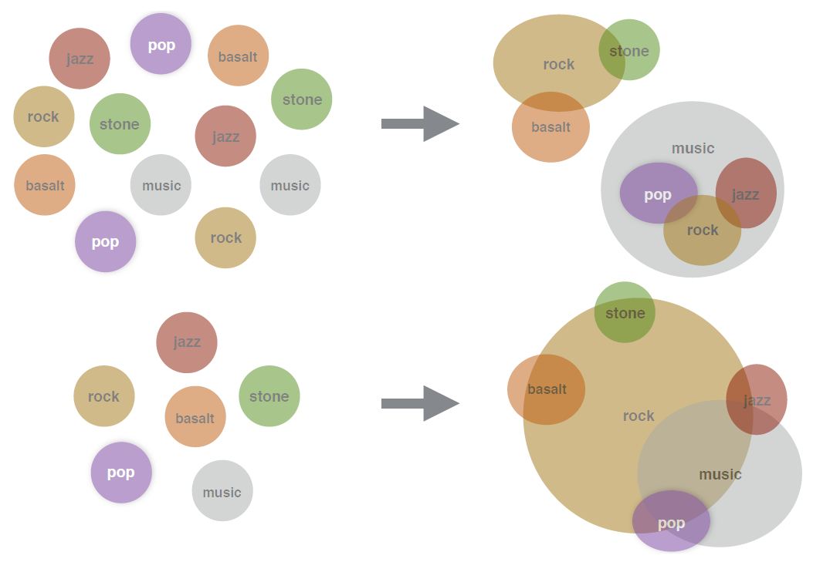

# Table of contents
1. [Introduction](#introduction)
2. [Methodology](#methodology)
3. [Application](#application)
4. [Conclusion](#conclusion)

## Introduction 
Representation of word is a fundamental task in language modelling. There are many techniques available for the task, starting from presenting every word as a binary one-hot vector corresponding to a dictionary. But modern approaches which learn to map words with similar meanings to nearby point vectors in a vector space from large datasets, are superior to those basic methods. These modern methodologies of word vectorization have become a go-to approach in NLP tasks.

There is an alternative proposal of word embedding provided by Vilnis and McCallum (2014), where words are represented by a whole probability distribution, specifically, Gaussian distribution instead of a point vector, and learn its mean and covariance matrix from data. This approach generalizes any deterministic point embedding, which can be fully captured by the mean vector of the Gaussian distribution. Moreover, the full distribution provides much richer information than point estimates for characterizing words, representing probability mass and uncertainty across a set of semantics.

Since a Gaussian distribution can have only one mode, the learned uncertainty in this representation can be overly diffuse for words with multiple distinct meanings. Athiwaratkun and Wilson (2017) proposed an improved method where they tried to represent each word with an expressive multimodal distribution for multiple distinct meanings, entailment, heavy tailed uncertainty and enhanced interpretability. Particularly, they model each word with a mixture of Gaussians, by learning all the parameters of this mixture using a maximum margin energy-based ranking objective, where the energy function describes the affinity between a pair of words. For analytic tractability with Gaussian mixtures, the inner product between probability distributions in a Hilbert space, known as the expected likelihood kernel is used as energy function.

## Methodology 
We simplified and described the methodology for multimodal Gaussian embedding in this section. The Gaussian Mixture (GM) model for word representation and a training method to learn the parameters of the mixture will be introduced, along with an energy function that compliments the model by retaining analytic tractability.

Each word w in a dictionary is represented as a Gaussian mixture with K components. The distribution of w,f_w, is given by the density
=\sum_{i=1}^{K}p_{w,i}N[\vec{x};\vec{\mu&space;}_{w,i},\Sigma&space;_{w,i}]=\sum_{i=1}^{K}\tfrac{p_{w,i}}{\sqrt{2\pi&space;|\Sigma&space;_{w,i}|}}e^{-\frac{1}{2}(\vec{x}-\vec{\mu&space;}_{w,i})^{T}\Sigma&space;_{w,i}^{-1}(\vec{x}-\vec{\mu&space;}_{w,i})})

where 

Model Parameters

&space;\\\Sigma&space;_{w,i}\&space;=>\&space;represents\&space;the\&space;component\&space;covariance\&space;matrix,\&space;containing\&space;uncertainty\&space;information)

The goal of this method is to learn all of the model parameters from a corpus of natural sentences to extract semantic information of words. Each Gaussian component’s mean vector of word w can represent one of the word’s distinct meanings. As an example, consider the word ‘rock’. One component of the word should represent the meaning related to ‘stone’, whereas other component should represent the meaning related to ‘music.’

This training procedure is similar to the continuous [skip-gram model](https://www.educative.io/edpresso/what-is-skipgram-embedding), where word embeddings are trained to maximize the probability of observing a word given another word. This process follows the distributional hypothesis that words occurring in contexts tend to be semantically related. For example, the words ‘pop’ and ‘music’ tend to occur nearer to each other than the words ‘pop’ and ‘tiger’; hence, ‘pop’ and ‘music’ have higher correlation compared to the other pair of words.

Every sample consists of two pairs of words, (w,c) and (w,c'). w is the word sampled from a sentence in the corpus and c is a nearby word within a context window l. For example, consider the sentence ‘I am a good boy’; the word w= ‘good’ has context words ‘I’, ‘am’, ‘a’, ‘boy’. A negative context word c' is a word obtained from random sampling. For example, for the previous sentence, the word ‘mathematics’ is a negative context word, i.e., it has no correspondence with the word w= ‘good’.

The objective is to maximize the energy between words that occur near each other, w and c, and minimize the energy between w and its negative context c'. The energy function is a measure of similarity between distributions.

A max-margin ranking objective is used here. It is also used for Gaussian embeddings, which pushes the similarity of a word and its positive context higher than of its negative context by a margin m:

=max(0,m-logE_{\theta&space;}(w,c)&plus;logE_{\theta&space;}(w,c')))

For popular practices of word vectorization, a usual choice for energy function is a dot product between two vectors. But here the words are represented as probability distributions instead of point vectors, so a measure is required so that it can reflect both similarity and uncertainty. In this study, the expected likelihood kernel, which is a generalization of an inner product between vectors to an inner product between distributions, i.e.,

=\int&space;f(x)g(x)dx=\left<f,g&space;\right>_{L_{2}})

For details, check out my Master's Dissertation report.

## Application 
The proposed mixture model is trained on a concatenation of two datasets: [UKWAC](https://wacky.sslmit.unibo.it/doku.php?id=corpora) (2.5 billion tokens) and [Wackypedia](https://wacky.sslmit.unibo.it/doku.php?id=corpora) (1 billion tokens), to learn the parameters. After training, learned parameters for each word w is obtained. This model is named as Word to Gaussian Mixture (w2gm).

The experiment is done with K=2 components for the w2gm model, but this also can be done with K=3. The reason behind this choice is most of the polysemous words have two meanings, there are very small number of words with three or more meanings. For this experiment the spherical covariance is considered.

To calculate similarity measures, three methods are used: Expected Similarity Kernel, Maximum Cosine Similarity, Minimum Euclidean Distance.

Examples of polysemous words and their nearest neighbors in the embedding space is shown in the following table to demonstrate the ability of the embedding method.

|Word|Co.|Nearest Neighbors|
|:----|:----|:----|
|rock|0|basalt:1, boulder:1, boulders:0, stalagmites:0, stalactites:0, rocks:1, sand:0, quartzite:1, bedrock:0|
|rock|1|rock/:1, ska:0, funk:1, pop-rock:1, punk:1, indie-rock:0, band:0, indie:0, pop:1|
|bank|0|banks:1, mouth:1, river:1, River:0, confluence:0, waterway:1, downstream:1, upstream:0, dammed:0|
|bank|1|banks:0, banking:1, banker:0, Banks:1, bankas:1, Citibank:1, Interbank:1, Bankers:0, transactions:1|
|Apple|0|Strawberry:0, Tomato:1, Raspberry:1, Blackberry:1, Apples:0, Pineapple:1, Grape:1, Lemon:0|
|Apple|1|Macintosh:1, Mac:1, OS:1, Amiga:0, Compaq:0, Atari:1, PC:1, Windows:0, iMac:0|
|star|0|stars:0, Quaid:0, starlet:0, Dafoe:0, Stallone:0, Geena:0, Niro:0, Zeta-Jones:1, superstar:0|
|star|1|stars:1, brightest:0, Milky:0, constellation:1, stellar:0, nebula:1, galactic:1, supernova:1, Ophiuchus:1|
|cell|0|cellular:0, Nextel:0, 2-line:0, Sprint:0, phones.:1, pda:1, handset:0, handsets:1, pushbuttons:0|
|cell|1|cytoplasm:0, vesicle:0, cytoplasmic:1, macrophages:0, secreted:1, membrane:0, mitotic:0, endocytosis:1|
|left|0|After:1, back:0, finally:1, eventually:0, broke:0, joined:1, returned:1, after:1, soon:0|
|left|1|right-hand:0, hand:0, right:0, left-hand:0, lefthand:0, arrow:0, turn:0, righthand:0, Left:0|

Nearest neighbors based on cosine similarity between the mean vectors of Gaussian components for Gaussian mixture embedding (for K=2) and Gaussian embedding are shown in the following table. The notation w:i denotes the ith mixture component of the word w.

|Word|Nearest Neighbors|
|:----|:----|
|rock|band, bands, Rock, indie, Stones, breakbeat, punk, electronica, funk|
|bank|banks, banking, trader, trading, Bank, capital, Banco, bankers, cash|
|Apple|Macintosh, Microsoft, Windows, Macs, Lite, Intel, Desktop, WordPerfect, Mac|
|star|stars, stellar, brightest, Stars, Galaxy, Stardust, eclipsing, stars., Star|
|cell|cells, DNA, cellular, cytoplasm, membrane, peptide, macrophages, suppressor, vesicles|
|left|leaving, turned, back, then, After, after, immediately, broke, end|

Take the example for the word ‘rock’. It has two meanings ‘stone’ and a form of music (‘rock music’). This word should have each of its meanings represented by a distinct Gaussian component. From the result in Table 1, we can see that the 0^th component of ‘rock’ being related to the words ‘basalt’, ‘boulders’ and the 1^st component being related to ‘funk’, ‘indie’, ‘hip-hop’. 
Similarly, consider the word ‘bank’. Its 0^th component represents the river bank (as the related words are ‘river’, ‘waterway’, ‘downstream’) and the 1^st component represents the financial bank (as the related words are ‘transactions’, ‘Citibank’, ‘banking’).

By contrast, in the above table, we can see that for Gaussian embeddings with one mixture component, nearest neighbors of polysemous words are predominantly related to a single meaning. For example, the words related to ‘rock’ are mostly regarding rock music. Similarly, for the word ‘bank’, related words are mostly regarding financial bank.

In the following figure, we can see that for the word ‘rock’, the top image represents the Gaussian mixture embedding with K=2 components, and the bottom image represents the Gaussian embedding (same as Gaussian mixture with K=1).

For the cases where a word only has a single meaning, the mixture components can be very close; for example, consider the word ‘stone’. One component of this is close to (‘stones’, ‘stonework’, ‘slab’) and the other is close to (‘carving’, ‘relic’, ‘excavated’), which reflects subtle variations in meanings.

The evaluation of the embeddings is done on several standard word similarity datasets, namely, [SimLex](https://fh295.github.io/simlex.html), [WS or WordSim-353, WS-S (similarity), WS-R (relatedness)](http://alfonseca.org/eng/research/wordsim353.html), [MEN](https://aclweb.org/aclwiki/MEN_Test_Collection_(State_of_the_art)), [MC](https://aclweb.org/aclwiki/MC-28_Test_Collection_(State_of_the_art)), [RG](https://aclweb.org/aclwiki/RG-65_Test_Collection_(State_of_the_art)) and [YP](https://www.researchgate.net/publication/257946337_Verb_similarity_on_the_taxonomy_of_WordNet_-_dataset). Each dataset contains a list of word pairs with a human score of how related or similar the two words are.

The Spearman correlation [Spearman, 1904] between the labels and our scores generated by the embeddings is calculated. It is a rank-based correlation measure that assesses how well the scores describe the true labels.

The results of the Gaussian mixture model are compared with the performance of word2vec and the original Gaussian embedding [Vilnis et al., 2014] in Table 2.

|Dataset|word2vec|w2g|w2gm/mc|w2gm/el|w2gm/me|
|:----|:----|:----|:----|:----|:----|
|SL|29.39|32.23|23.31|26.02|27.59|
|WS|59.89|65.49|73.47|62.85|66.39|
|WS-S|69.86|76.15|76.73|70.08|73.3|
|WS-R|53.03|58.96|71.75|57.98|60.13|
|MEN|70.27|71.31|73.55|68.5|67.7|
|MC|63.96|70.41|79.08|76.75|80.33|
|RG|70.01|71|74.51|71.55|73.52|
|YP|39.34|41.5|45.07|39.18|38.58|

From the results in Table 2, we can see that for most of the datasets, w2gm model has performed the best, with the maximum cosine similarity as the similarity measure. This model has also outperformed the most popular method word2vec for most of the datasets, namely, SL, WS, WS-S, WS-R, MEN, RG and YP. The minimum Euclidean distance is a better metric for the MC dataset.

## Conclusion 
Probabilistic word embedding is a relatively new idea, which has the potential to model language in a more expressive way, and to make advancement in the state of the art. Multimodal word distributions has shown that the shape of a word distribution can express much more semantic information than any point representation.

We tried to come with a new idea of representing words as discrete distribution over a dictionary 

Let, N be the \&space;is\&space;the\&space;N\times&space;N\&space;stochastic\&space;matrix\&space;where\&space;p_{i,j}\&space;is&space;\&space;the\&space;probability\&space;that\&space;word\&space;w_{j}\&space;is\&space;associated\&space;with\&space;the\&space;word\&space;w_{i}.)

We can use the energy functions mentioned before to represent the distances between words. The challenge in this procedure will be to handle the huge stochastic matrix which is a sparse matrix and do further operations.

This methodology has the potential to open the doors of a new path of applications in language modelling, building new types of supervised language models constructed to more fully leverage the rich information provided by word distribution.