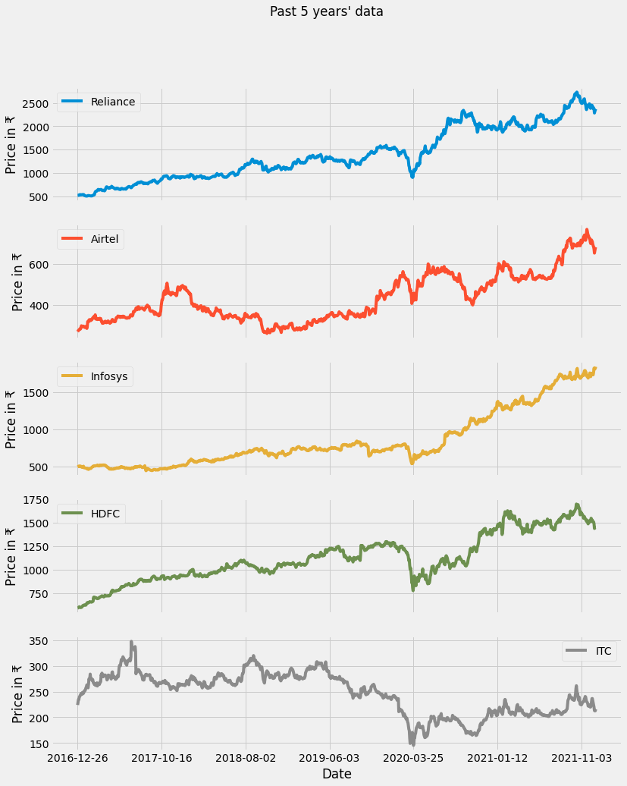
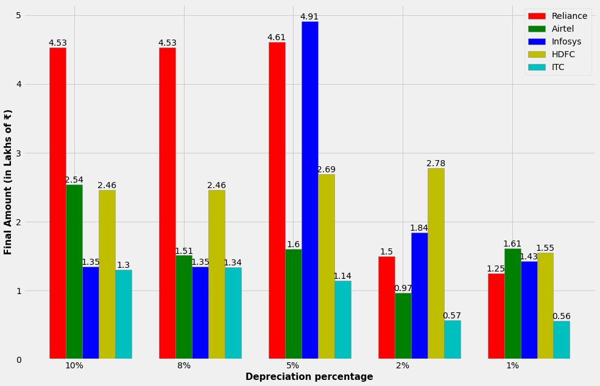
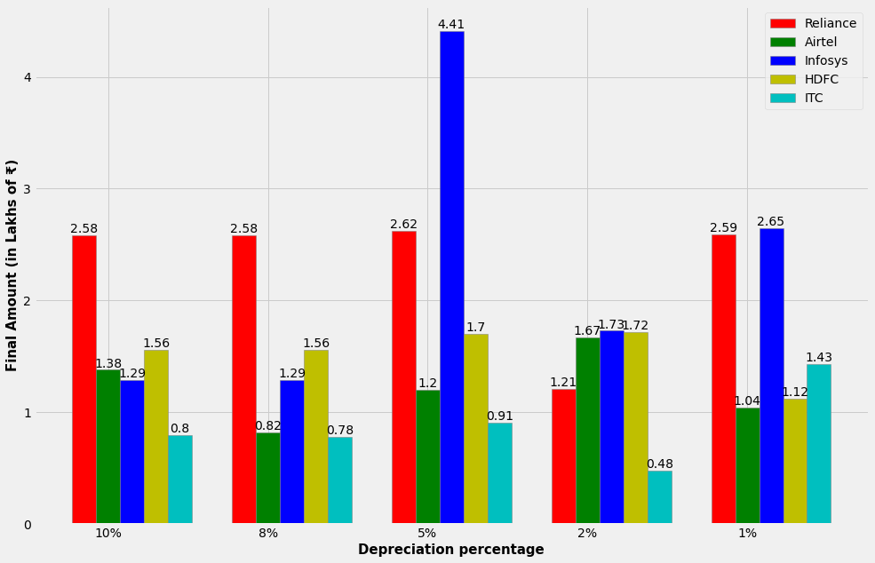
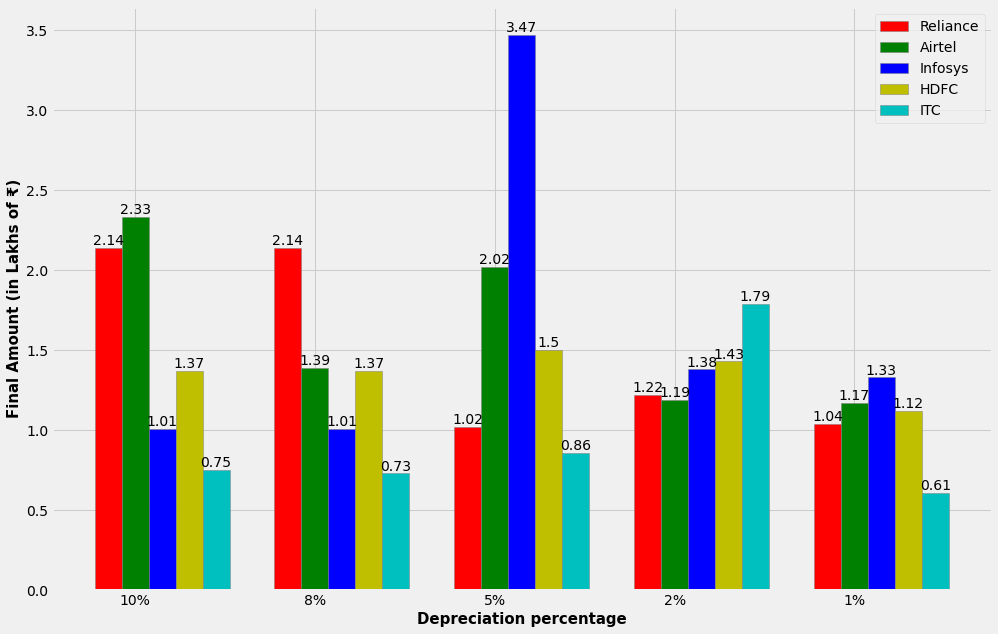
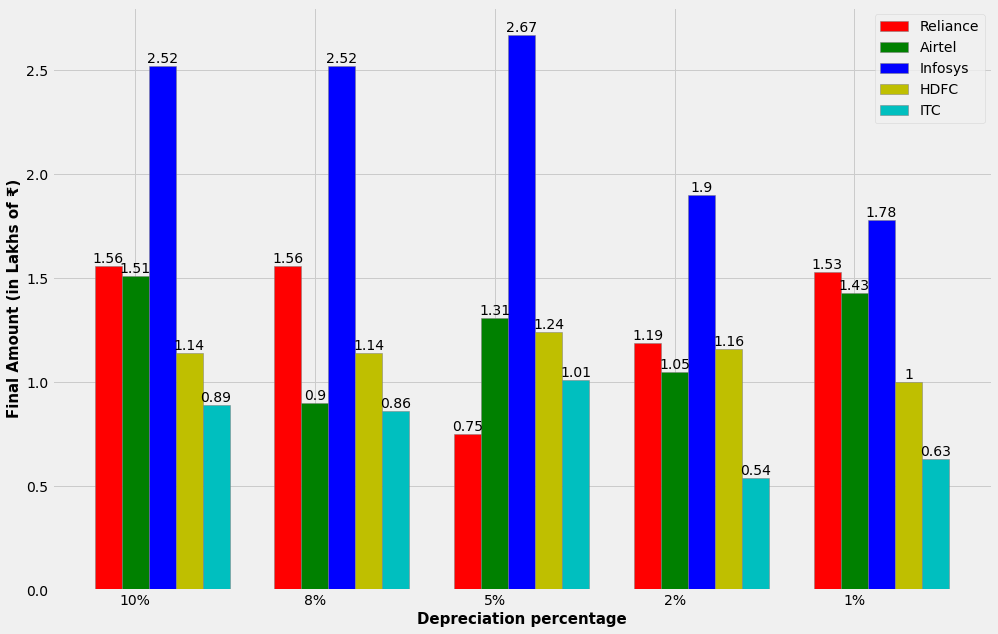
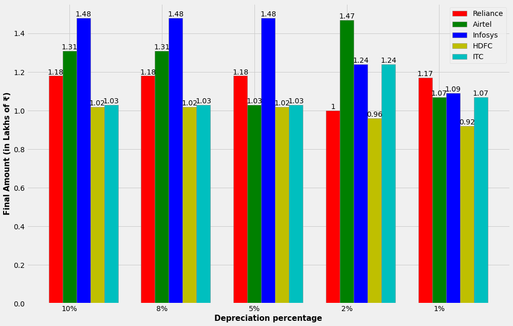

# Table of contents
1. [Introduction](#introduction)
2. [Methodology](#methodology)
3. [Application](#application)
4. [Conclusion](#conclusion)


## Introduction <a name="introduction"></a>
The Indian stock market has performed exceptionally well in the recent past. If we see the index fund like Nifty 50, the growth rate is almost 87% in the last 5 years. Though there was a dip due to the pandemic in the first quarter of 2020, the market has come round and it is in a growing trend. There is a significant growth in the number of investors in the recent years in India.  According to a report by The Wire, in FY21 a total of 1.43 Crore new investors were added up by NDSL and CDSL. Some of the key factors behind this are the rise of Fintech startups and availability of cheap internet. These companies have transformed stock market investing online, very easy and convenient. Many new startups are being built in India in this investment field, where these companies come up with their various strategies of investment. This study can be considered as an analysis of such an investment strategy which can be a potential business idea in the investment field.

The use of algorithms in trading increased after computerized trading systems were introduced in American financial markets during the 1970s. In 1976, the New York Stock Exchange introduced the Designated Order Turnaround (DOT) system for routing orders from traders to specialists on the exchange floor. In the following decades, exchanges enhanced their abilities to accept electronic trading, and by 2009, upwards of 60 percent of all trades in the U.S. were executed by computers.

A Markov process is a stochastic model describing a sequence of possible events in which the probability of each event depends only on the state attained in the previous event. If we try to see the definition of Markov process,
Let the state space X be a bounded compact subset of the Euclidean space, the discrete-time dynamic system _{t\in&space;N}\in&space;X) is a Markov process or Markov chain if =P(x_{t&plus;1}=x&space;|&space;x_{t})) so that all the information needed to predict (in probability) the future is contained in the current state (Markov property). Given an initial state , a Markov chain is defined by the transition probability p such that &space;=&space;P(x_{t&plus;1}=y&space;|&space;x_{t}=x))

Dynamic programming is mainly an optimization method over recursion. It is an application of Markov process to solve real world optimization problems. In this study, we are trying to implement a stock trading strategy based on Markov process and develop a dynamic programming algorithm for the purpose and analyze the result in the context of Indian market.

## Methodology <a name="methodology"></a>
A three-step methodology is used to make the strategy of investing as a Markov process. The step-by-step details are as follows:

Step 1: Suppose, we have X amount of money and we will invest the money in this way – on day 1, we will invest all the money and wait until the day when the price of stock is depreciated by a certain percentage, say p.

Step 2: When the price of stock is depreciated by a percentage p, we will sell the stocks and get the money.

Step 3: We will again invest the money when the stock price is depreciated by p, and the process goes on. We will do this for a certain period, say n years.

This trading strategy is based on a Markov process as this is a stochastic process, the number of possible outcomes (price depreciation by percentage p – yes or no) is finite and the outcome at any stage depends only on the outcome of the previous stage (if the price is depreciated in the previous stage stocks are bought, then those will be sold in the next stage if the price is depreciated, and vice versa).

Suppose,  represents n price depreciation fractions and starting amount is X. We will try this strategy for the n different depreciation factors.

You can see the code for the dynamic programming algorithm below:

```
def dp_trading(amount, prices, depreciation):
    final_amount_list = []
    for p in depreciation:    
        money_in_hand = amount
        prev_price = prices[0]
        no_of_stock = money_in_hand/prev_price
        money_in_hand = 0

        for day_price in prices[1:]:
            if (day_price - prev_price)/prev_price < -p:
                if no_of_stock > 0:
                    money_in_hand = no_of_stock * day_price
                    no_of_stock = 0
                else:
                    no_of_stock = money_in_hand/day_price
                    money_in_hand = 0
            else:
                pass
            prev_price = day_price

        if no_of_stock>0:
            money_in_hand = no_of_stock * day_price
        else:
            money_in_hand = money_in_hand

        final_amount_list.append(money_in_hand)
    
    return final_amount_list
```
## Application <a name="application"></a>
This study is carried out on 5 different Indian stocks which are operating in 5 different sectors and are at the top in the respective industries. The stocks are Reliance (Production, Oil & Gas), HDFC (Banking), Infosys LTD (Information Technology), Bharti Airtel LTD (Telecom) and ITC LTD (Tobacco). The data of these stocks are collected from the National Stock Exchange and for the period from Dec 26, 2016 to Dec 23, 2021.

Five different datasets are prepared for the study with the data for past 5, 4, 3, 2 and 1 years. The dataset consists of 7 features – Date, Open, High, Low, Close, Adj Close and Volume. We will create a new feature Price, which is the average of features High and Low, which are the highest and lowest price of the stock on a particular day. We will only consider the features Date and Price for our analysis.

In the following figure, we can see the time series plot for the past 5 years’ data of the 5 stocks. We can see an overall growing trend for all the stocks except the last one (ITC). During March 2020, there is a dip in all the cases which is natural because of the Covid-19 pandemic. But after that most of the stocks have grown drastically which is explainable. Due to move in online system, the IT industry saw a boom, and also the telecom industry for rise in internet services. Similarly for Reliance and HDFC the growth is in the higher side. For ITC, the pandemic has reduced the rise of tobacco industry in a certain level. But overall, the Indian market has performed well in the past 5 years.



We did the experiment with total of ₹ 5 Lakhs, i.e., ₹ 1 Lakh each for the five stocks, and we took this amount for all the further experiments. As the price depreciation percentage, we took five different percentages – 10%, 8%, 5%, 2% and 1%.

At first, we applied the algorithm for the past 5 years’ data. In the following figure, we can see that for Reliance, we are getting positive return for all the depreciation percentages; with 10% and 8% depreciation, the return is 4.53 Lakhs on 1 Lakh, and for 5%, it is highest (4.61 Lakhs). For Airtel, the return is highest (2.54 Lakhs) for 10% depreciation; for 8%, 5% and 1%, the return is similar (1.51, 1.6 and 1.61 Lakhs respectively) and it is decent; for 2% the return is negative (0.97 Lakhs). For Infosys, the return is highest (4.91 Lakhs) for 5% depreciation, which is very different from the other returns (1.35, 1.84 and 1.43 Lakhs). For HDFC, all the returns are similar (2.46, 2.69 and 2.78 Lakhs) except the return for 1% depreciation (1.55 Lakhs). For ITC, the return is positive for 10%, 8% and 5%; but it is negative for 2% and 1%.

So, in total we are getting maximum return for 5% depreciation (14.95 Lakhs on 5 Lakhs, 299% return).



Next, applying the algorithm for the past 4 years’ data, in the following figure, we can see that for Reliance, we are getting similar return (2.58, 2.62 and 2.59 Lakhs) for all the depreciation percentages except 2%, which is lowest (1.21 Lakhs). For Airtel, the return is highest (1.67 Lakhs) for 2% and is lowest (0.78 Lakhs) for 8% depreciation. For Infosys, the return is highest (4.41 Lakhs) for 5% and the other returns are decent. For HDFC, the returns are similar (1.56, 1.7, 1.72 Lakhs) except for 1% depreciation, which is lowest (1.12 Lakhs). Lastly, for ITC, all the returns are negative except 1% depreciation (1.43 Lakhs).

In total, we are getting maximum return for 5% depreciation (10.84 Lakhs on 5 Lakhs, 216.8% return).



Applying the algorithm for the past 3 years’ data, in the following figure, we can see that for Reliance, we are getting 2.14 Lakhs for 10% and 8%, which is the maximum, for all the other depreciation percentages, the return is decent (1.22, 1.04 and 1.02 Lakhs). For Airtel, the return is highest (2.33 Lakhs) for 10% and for 5% it is also on the higher side (2.02 Lakhs), others are decent (1.39, 1.19 and 1.17 Lakhs). For Infosys, the return is highest (3.47 Lakhs) for 5% and the other returns are decent. For HDFC, the returns are similar (1.37, 1.5, 1.43 Lakhs) except for 1% depreciation, which is lowest (1.12 Lakhs). Lastly, for ITC, all the returns are negative except 2% depreciation (1.79 Lakhs). 

In total, we are getting maximum return for 5% depreciation (8.87 Lakhs on 5 Lakhs, 177.4% return).



Applying the algorithm for the past 2 years’ data, in the following figure, we can see that for Reliance, we are getting similar return for 10%, 8% and 1% (1.56, 1.53 Lakhs), negative return (0.75 Lakhs) for 5% and decent return (1.19 Lakhs for 2%). For Airtel, the return is highest (1.51 Lakhs) for 10%, for 5% and 1%, it is also on the higher side (1.31 and 1.43 Lakhs respectively. For Infosys, all the returns are on the higher side (2.52, 2.67, 1.9 and 1.78 Lakhs). For HDFC, the returns are similar (1.14, 1.24 and 1.16 Lakhs) except for 1% depreciation, which is lowest (1 Lakh). Lastly, for ITC, all the returns are negative except 5% depreciation (1.01 Lakhs). 

In total, we are getting maximum return for 10% depreciation (7.62 Lakhs on 5 Lakhs, 152.4% return).



Applying the algorithm for the past 1 year’s data, in Fig. 6, we can see that for Reliance, we are getting similar return for all depreciation percentages (1.18 and 1.17 Lakhs), except for 2% (1 Lakh). For Airtel, the return is highest (1.47 Lakhs) for 2%, for 10% and 8%, it is also on the higher side (1.31 Lakhs) and for others it is decent (1.03 and 1.07 Lakhs). For Infosys, all the returns are on the higher side (1.48 and 1.24 Lakhs), except for 1% depreciation (1.09 Lakhs). For HDFC, the returns are very close (1.02 Lakhs) except for 2% and 1% depreciation, which are negative return (0.96 and 0.92 Lakhs). Lastly, for ITC, all the returns are very close (1.03 and 1.07 Lakhs) except 2% depreciation (1.24 Lakhs), which is highest. 

In total, we are getting maximum return for 10% and 8% depreciation which are same (6.02 Lakhs on 5 Lakhs, 120.4% return).



## Conclusion <a name="conclusion"></a>
From the results we obtained, we can see that this strategy is working fine for all the different depreciation percentages, and it is giving a very good return for all the cases. But the return also depends on depreciation percentage and time. For most of the cases, the strategy with the 5% depreciation is giving the best return with 3+ years of investing time. For less time (less than or equal to 2 years), the strategy with 10% depreciation is giving the best return. Overall, this strategy is working well and giving good returns. Based on the different results, we can say that with more time the returns will be higher, and for that the strategy with 5% works well giving the investment strategy robustness. According to our choice, some stocks are very high performing (e.g., Infosys), some are moderate (e.g., Airtel) and some are declining (e.g., ITC). So, with this portfolio of stocks, the strategy is performing really good and this is a such an idea which can be implemented personally or on a potential business level.